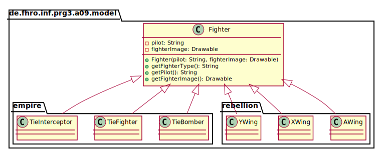
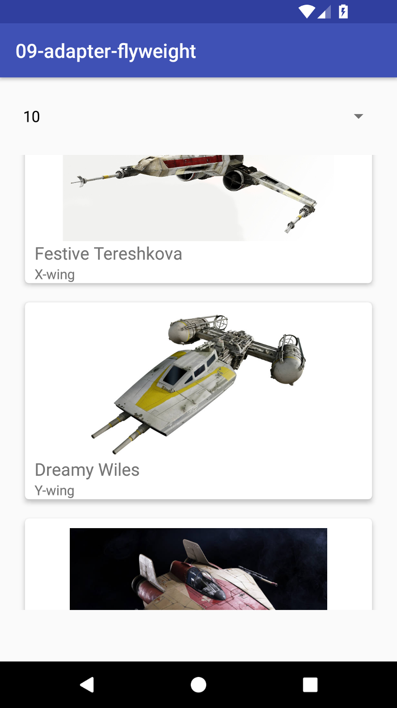

_This is an assignment to the class [Programmieren 3](https://hsro-inf-prg3.github.io) at the [University of Applied Sciences Rosenheim](http://www.fh-rosenheim.de)._

# Assignment 9: Adapter and Flyweight

This assignment covers the two design patterns _Adapter_ and _Flyweight_.

At first you have to implement an adapter to display items in a list with a custom row element.
Afterwards you will refactor the given app to improve the performance by implementing the flyweight pattern.

## Setup

1. Create a fork of this repository (button in the right upper corner)
2. Clone the project (get the link by clicking the green _Clone or download button_)
3. Import the project to your Android Studio; it behaves almost the same as IntelliJ.

## Adapter

The given app generates a random fleet of Star Wars space fighters.
The following UML show the class hierarchy of the fighter classes:



Every fighter consists of a pilot, a type and an image of the fighter type.

_Side note: the names of the pilots are randomly generated by an own implementation of the [Docker 'algorithm'](https://github.com/moby/moby/blob/master/pkg/namesgenerator/names-generator.go) to create random container names - just as a fun fact._

Fighters are created by the given class `FighterFactory`.

_Note: in the opposite to the assignment of last week the `FighterFactory` is a class which has to be instantiated due to the fact that it needs a reference to the Android app `Context` to be able to load images._

To display your list of fighters the layout `activity_main.xml` contains a list view.
But it is not possible to display all attributes a class has with the default `ArrayAdapter<>`.
To modify the default behavior of `ArrayAdapter<>` and `ListView` a custom adapter has to implemented which is responsible for moving the data from your object into a view element.

To implement a custom adapter (for a `ListView`) you have to implement a class which extends the default `ArrayAdapter<>`.

_Hint: this [tutorial](https://github.com/codepath/android_guides/wiki/Using-an-ArrayAdapter-with-ListView#using-a-custom-arrayadapter) is good starting point if you have no clue how to implement a custom `ArrayAdapter`_

1. Implement a custom `FighterListAdapter`.
2. Create an instance of your `FighterListAdapter` in the `MainActivity`.
3. Assign it to the instance `fighterListView` (see line 45).
4. Complete the method `onItemSelected(...)` to display your first fighters.

_Remark: an `FighterFactory` instance is already declared and created in the `MainActivity`, use it to create new fighters within the `onItemSelected(...)` method._

_Remark 2: If you don't get the switch between empire and rebellion working, ignore it for now._

When you have completed all the above steps your app should look like that:



## Flyweight - Part 1

As you may have noticed if you set the page size to 20 or above, the performance of the app is getting worse the more fighter instances you have created.
If you had a look at the `FighterFactory` you might have seen that every time a fighter has to be created the factory loads the corresponding image into the memory and assigns the loaded image to the created fighter instance.

Here comes the Flyweight pattern into play.

1. Refactor the class `FighterFactory` to load all images in a cache when the factory is created.
2. Modify the process of creation to reuse the already loaded images.

_Hint: think of a data structure that enables you to retrieve the matching image with a single call (e.g. `Map<String, Drawable>` or `Map<Class<?>, Drawable>`._

## Flyweight - Part 2

To further improve the performance of the app you can use the Android built-in `RecyclerView`. [This document](https://developer.android.com/training/material/lists-cards.html) explains how to use the `RecyclerView` in combination with so called _card_ elements.
As the `fighter_item.xml` is already a _card_ element you can ignore all `.xml` parts!

The concept of the `RecyclerView` is also based on the Flyweight pattern.
A `RecyclerView` keeps track of all created _row_ elements and reuses (rebinds) them when they aren't visible any more i.e. when they left the screen because you scrolled up or down.

To refactor the app to use a `RecyclerView` you have to follow these steps:

1. Implement a **new** adapter class `FighterRecyclerViewAdapter` as described in the Android docs (unfortunately the `RecyclerView` needs an own implementation as it is not compatible with `ArrayAdapter<>`s).
2. Modify the file `activity_main.xml` and replace the whole given `ListView` node with this snippet:

```xml
<android.support.v7.widget.RecyclerView
        android:id="@+id/fighterListView"
        android:layout_width="match_parent"
        android:layout_height="470dp"
        android:layout_marginEnd="16dp"
        android:layout_marginStart="16dp"
        android:layout_marginTop="16dp"
        app:layout_constraintTop_toBottomOf="@id/party_switch" />
```
3. Replace the `ListView` reference in the class `MainActivity` by a reference to the newly created `RecyclerView`.
4. Create an instance of your `FighterRecyclerViewAdapter` and assign it to the reference of your `RecyclerView`.
5. Assign a new instance of `LinearLayoutManager` as layout manager to your `RecyclerView`.
6. Adopt the changes in the method `onItemSelected(...)`

_Remark: to handle different page sizes you have two options: create a new `FighterRecyclerViewAdapter` instance whenever the page size changes or add a `clear()` and a `addAll(...)` method to your `FighterRecyclerViewAdapter` implementation to handle manipulation of the underlying list. If you choose the second option you have to tell (`notify`) the `super` class that your collection was modified by calling `notifyDataSetChanged();`_

### A word about when to use a `RecyclerView`

The `RecyclerView` does not have to create 1000 objects of a row element when you have a list of 1000 items because it reuses (recycles) already existing row elements.

But there's still one problem: the `RecyclerView` does not affect the items in the list you want to display. Because of that even if you would have used the `RecyclerView` before you refactored the `FighterFactory` class the memory consumption of the app would have been (approximately) the same because all the images are loaded into the memory before the `RecyclerView` comes into play.